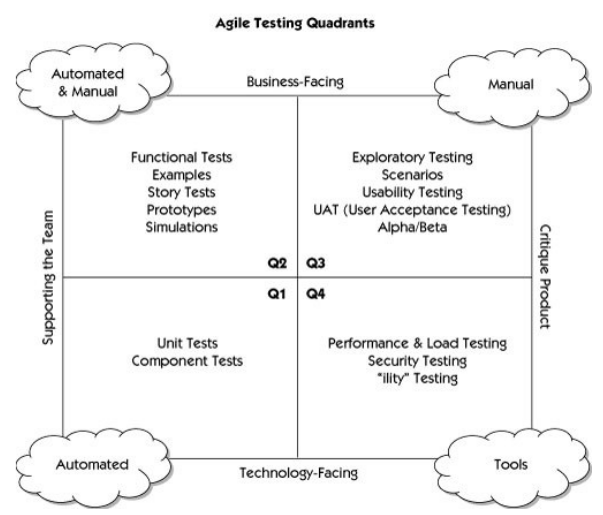

# Sisteminha do Sobrinho

### Atividade avaliativa da disciplina "Qualidade e Testes de Software"

Seu Antonio adora livros. E possui uma pequena biblioteca pessoal. Para melhor gerenciar seu acervo, contratou um amigo do sobrinho para desenvolver seu sistema de biblioteca pessoal.
O sistema foi entregue e encontra-se disponível para análise neste respositório.

Ele ficou satisfeito com o que foi entregue. Entretanto, ele quer um novo requisito funcional: permitir login/logout. 

Para sua surpresa, ao contactar o antigo desenvolvedor, não conseguiu mais, tendo suas mensagens ignoradas.

Buscou alternativas, e outros dois prestadores de serviço, ao analisar o código, recusaram o serviço, alegando que o código estava mal feito, e que seria melhor refazer o sistema.

### Sua missão

Seu Antônio ficou em dúvidas sobre a qualidade de seu sistema de biblioteca pessoal. Como é uma pessoa leiga no assunto, contactou você para fazer uma análise e emitir um parecer. Eis alguns questionamentos do seu Antônio:

    1) O sistema está bem estruturado e desenvolvido segundo boas práticas ?

    - Caso não, quais os apontamentos de melhorias você recomendaria ?
    
    - O sistema está seguro ? Há riscos de injeção de SQL ?

    2) Os dois profissionais contactados posteriormente recomendaram refazer todo o sistema. Essa recomendação procede ?
    
    - Faça uma análise de viabilidade, caso julgue necessário reescrever o sistema, explique seus argumentos de forma que seu Antônio entenda.

    3) O sistema está no ar somente via endereço ip.

    - O que seu Antônio deverá fazer para ter um domínio para seu sistema ?
    - Quais o custo para isso ?
    - O primeiro profissional optou por hospedar na DigitalOcean. Você concorda ou discorda ? Caso discorde, qual outro provedor recomendaria ?

    4) Testes

    - Segundo o quadrante de testes ágeis, qual(is) teste(s) você aplicou/aplicará em sua auditoria ?

Você deve fazer uma auditoria. A fase de planejamento e execução deve ocorrer na sala Maker na Fatec Araras no dia 01 de abril de 2025, a partir de 19hs. 
Você terá uma semana para elaborar seu relatório fazendo os apontamentos da auditoria e emitindo sua opinião como especialista em software multiplataforma.

Dica:
Não se esqueça que seu leitor é leigo, e não possui conhecimento de termos técnicos. Seja o mais didático possível.

## Sistema de Biblioteca em PHP e MySQL

### Descrição
Este é um sistema de gerenciamento de biblioteca desenvolvido em PHP puro com MySQL. Ele permite o cadastro de livros para um único.

### Servidor

O servidor temporário encontra-se em: [Sisteminha do Sobrinho](http://137.184.56.192/)